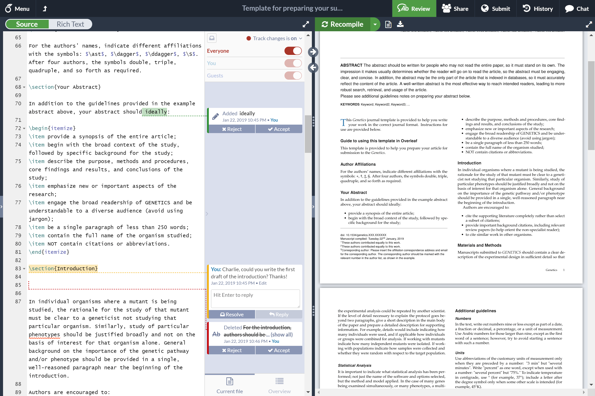

<!--
Este archivo README esta generado automaticamente<https://github.com/YunoHost/apps/tree/master/tools/readme_generator>
No se debe editar a mano.
-->

# Overleaf para Yunohost

[](https://ci-apps.yunohost.org/ci/apps/overleaf/)  

[](https://install-app.yunohost.org/?app=overleaf)

*[Leer este README en otros idiomas.](./ALL_README.md)*

> *Este paquete le permite instalarOverleaf rapidamente y simplement en un servidor YunoHost.*  
> *Si no tiene YunoHost, visita [the guide](https://yunohost.org/install) para aprender como instalarla.*

## Descripción general

Overleaf is an open-source online real-time collaborative LaTeX editor.


**Versión actual:** 2024.07.04~ynh1

## Capturas



## Documentaciones y recursos

- Sitio web oficial: <https://www.overleaf.com>
- Documentación usuario oficial: <https://www.overleaf.com/learn>
- Repositorio del código fuente oficial de la aplicación : <https://github.com/overleaf/overleaf>
- Catálogo YunoHost: <https://apps.yunohost.org/app/overleaf>
- Reportar un error: <https://github.com/YunoHost-Apps/overleaf_ynh/issues>

## Información para desarrolladores

Por favor enviar sus correcciones a la [`branch testing`](https://github.com/YunoHost-Apps/overleaf_ynh/tree/testing

Para probar la rama `testing`, sigue asÍ:

```bash
sudo yunohost app install https://github.com/YunoHost-Apps/overleaf_ynh/tree/testing --debug
o
sudo yunohost app upgrade overleaf -u https://github.com/YunoHost-Apps/overleaf_ynh/tree/testing --debug
```

**Mas informaciones sobre el empaquetado de aplicaciones:** <https://yunohost.org/packaging_apps>
